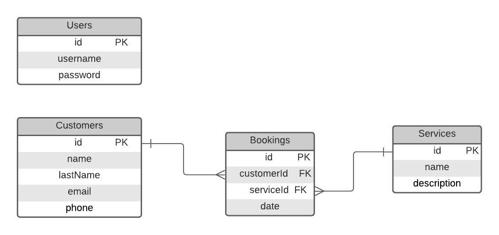

# Running the Application

This guide will walk you through the process of running our application using Docker. Please follow each step carefully to ensure everything runs smoothly.

## Prerequisites

Before you start, ensure Docker is installed on your system. You can download Docker from [here](https://www.docker.com/products/docker-desktop).

## Steps to Run the Application

### 1. Clone the Repository

First, clone the repository of the application to your local machine. Open your terminal or command prompt and run the following command:


```bash
git clone https://github.com/Milton090/bookingApp.git
```

### 2. Configure the `.env` File (Optional)

The `.env` file is used to store environment variables that your application needs to function correctly. This file is optional but recommended for configuring specific parameters for your environment.

#### Create the `.env` File

1. Navigate to the root of the project in your terminal or command prompt:

    ```bash
    cd bookingApp
    ```

2. Create a `.env` file in the root of the project:

    #### On Linux/macOS:

    ```bash
    touch .env
    ```

    #### On Windows (PowerShell):

    ```powershell
    New-Item -Path .env -ItemType File
    ```

    #### On Windows (CMD):

    ```cmd
    echo.> .env
    ```

3. Open the `.env` file in your text editor and add the necessary environment variables. Here is an example of what to include:

    ```env
    CLIENT_PORT='5000'
    DB_PORT='1433'
    SA_PASSWORD='yourSAPassword#'
    DB_PASSWORD='yourDB*Password'
    ```

    - `CLIENT_PORT`: The port where the Angular app will run on your local machine (e.g., `4200`).
    - `DB_PORT`: The port where the SQL Database will run on your local machine (e.g., `1433` for SQL Server).
    - `SA_PASSWORD`: The password for the SQL Server `sa` user. Ensure it meets your SQL Server’s password complexity requirements, including at least one uppercase letter, one lowercase letter, one number, and one special character.
    - `DB_PASSWORD`: The password for the SQL Database user. It should follow the same complexity requirements as `SA_PASSWORD`.

> **Note:** If you do not configure the `.env` file, the application will run with default values provided in the `docker-compose.yml` file. The default configuration should be sufficient for most use cases.

### 3. Run Docker Compose

Docker Compose allows you to define and run multi-container Docker applications. To start the application:

1. Ensure you are in the root directory of the project where the `docker-compose.yml` file is located. After cloning the repository, navigate to the `bookingApp` directory using:

    ```bash
    cd bookingApp
    ```

2. Run the following command to start all services defined in the `docker-compose.yml` file:

    ```bash
    docker compose up
    ```

   This command will download the necessary images, build the containers, and start the application.

3. Wait for Docker Compose to complete the initialization. You should see messages in the terminal indicating that the containers are active.

### 4. Verify the Application

- The frontend will run on the port specified by `CLIENT_PORT` in your `.env` file, or by default on `http://localhost:4200`.
- The backend will be available at `http://localhost:3000/api/`.

## Additional Information

### Diagrams

To better understand the architecture and database design of the application, refer to the following diagrams:

#### Database Relational Diagram

This diagram illustrates the relationships between the different entities in the database. It provides a visual representation of how the tables are connected and the nature of their relationships.



#### Architecture Diagram

This diagram shows the overall architecture of the application, including the interaction between various components and services. It helps in understanding the structure and flow of the application.


### API Documentation

You can find the API documentation [here](https://www.postman.com/aerospace-specialist-44844858/workspace/miltonramirezpublic/collection/33019708-7b1c2ccd-3d46-4c0f-92df-42b645af7d6f?action=share&creator=33019708) on Postman.
